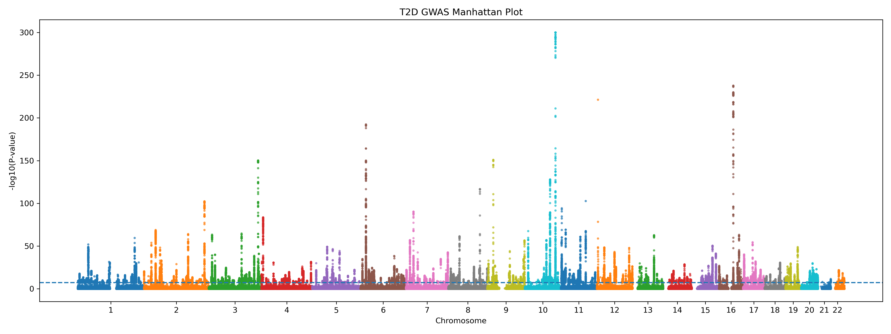
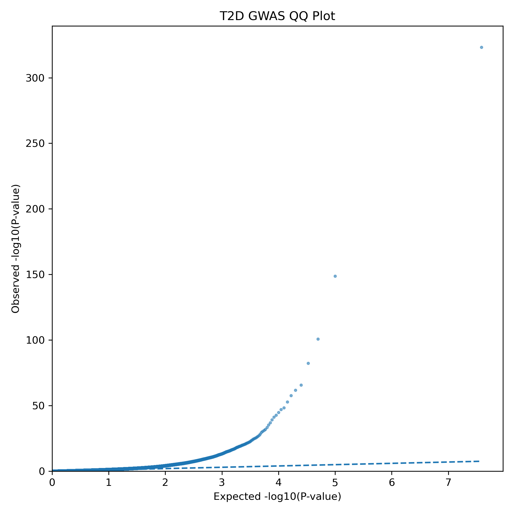
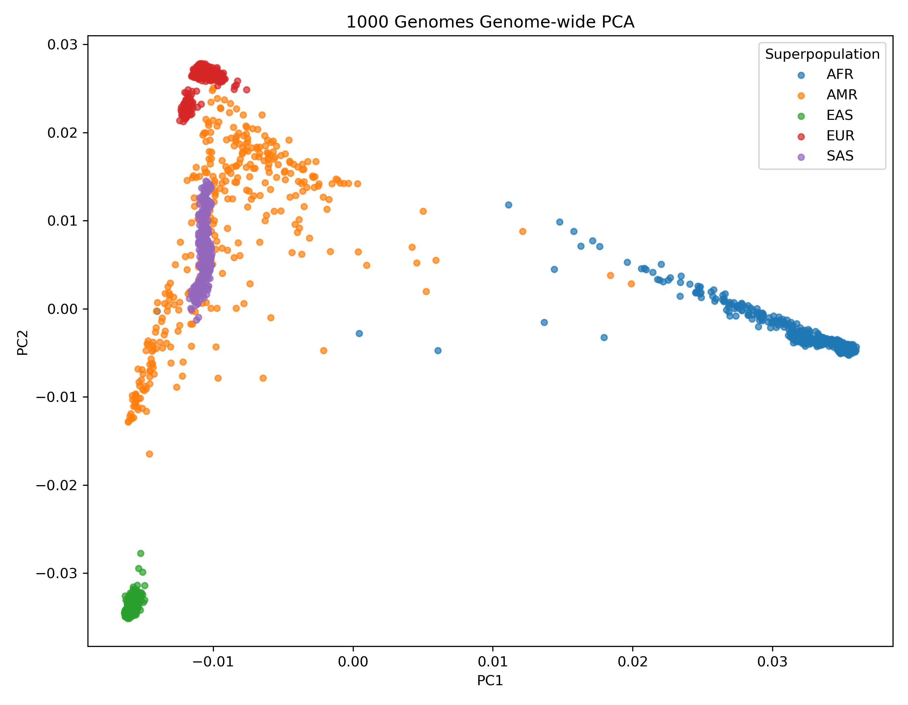
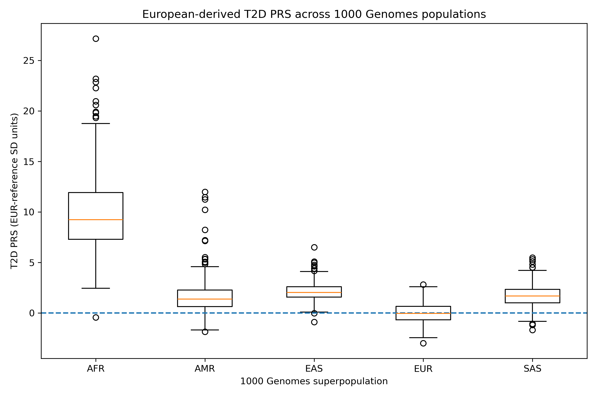

# Type 2 Diabetes Genomics & Polygenic Risk Score Pipeline

# Type 2 Diabetes Genomics & Polygenic Risk Score Pipeline

**Python · PLINK2 · Bash · Linux · GWAS · Population Genetics · Polygenic Risk Scoring**

Built an end-to-end genomics workflow to integrate **19.3 million Type 2 Diabetes GWAS associations** with **12.1 million genome-wide variants from 2,504 individuals** in the 1000 Genomes Project.

The challenge was to make two large genomic datasets suitable for joint analysis while accounting for **variant representation, allele alignment, linkage disequilibrium and population structure**. Using Python, PLINK2, Bash and Linux, I performed GWAS quality control, genome-wide genotype filtering, population PCA using **286,036 LD-pruned SNPs**, and allele harmonisation that matched **9.25 million GWAS–genotype variants**.

For polygenic scoring, **117,775 candidate variants** passing the GWAS threshold were reduced to **3,650 LD-clumped index variants** using a European 1000 Genomes LD reference. These variants were then used to generate polygenic scores for **all 2,504 individuals across five superpopulations**.

The final analysis showed substantial ancestry-dependent shifts when a **European-derived T2D polygenic score** was applied across diverse populations, demonstrating an important limitation in the cross-population portability of ancestry-specific polygenic scores. Because the 1000 Genomes dataset does not contain suitable T2D phenotype information, these differences are interpreted as **PRS scaling and portability effects rather than differences in disease risk**.

## Project at a Glance

| Metric | Result |
|---|---:|
| T2D GWAS variant records processed | **19,303,703** |
| Genome-wide significant variant associations | **64,948** |
| 1000 Genomes individuals | **2,504** |
| Genome-wide target SNPs | **12,057,349** |
| LD-pruned SNPs used for PCA | **286,036** |
| GWAS–genotype variants harmonised | **9,251,622** |
| Variants entering LD clumping | **117,775** |
| LD-clumped PRS index variants | **3,650** |
| Individuals successfully scored | **2,504 / 2,504** |
| Superpopulations compared | **5** |

**Note:** The 64,948 genome-wide significant records are significant **variant associations**, not 64,948 independent loci.

---

## Project Objective

Polygenic risk scores combine the effects of many genetic variants into a single score representing inherited genetic predisposition.

However, generating a PRS requires more than applying GWAS effect sizes directly to genotype data. The discovery GWAS and target genotype dataset must be compatible in terms of:

- genome build
- chromosome and genomic position
- allele representation
- variant availability
- linkage disequilibrium
- population structure

This project builds that workflow from the ground up using **European-ancestry T2D GWAS summary statistics** and **1000 Genomes Phase 3 genotype data**.

The second objective was to examine the behaviour of a European-derived PRS across genetically diverse 1000 Genomes populations and demonstrate an important challenge in statistical genetics: **polygenic scores may not transfer directly across ancestry groups**.

---

## Workflow

The analysis integrates T2D GWAS summary statistics with 1000 Genomes genotype data through genome-wide quality control, population structure assessment, variant harmonisation, LD clumping and polygenic risk scoring.


## Data Sources

### Type 2 Diabetes GWAS

European-ancestry summary statistics from the **Type 2 Diabetes Global Genomics Initiative (T2DGGI)** associated with:

**Suzuki K, Hatzikotoulas K, Southam L, et al.**  
*Genetic drivers of heterogeneity in type 2 diabetes pathophysiology.*  
Nature 627, 347–357 (2024).  
DOI: `10.1038/s41586-024-07019-6`

The summary statistics used in this project contained:

- chromosome
- genomic position
- effect allele
- non-effect allele
- effect size (Beta)
- standard error
- effect allele frequency
- association P-value
- case/control sample information

### 1000 Genomes Project

**1000 Genomes Project Phase 3**

- **2,504 individuals**
- autosomes 1–22
- GRCh37 / hs37d5 reference
- five superpopulation groups:
  - AFR — African
  - AMR — Admixed American
  - EAS — East Asian
  - EUR — European
  - SAS — South Asian

Large raw genomic files are not included in this repository because of their size.

---

# Analysis

## 1. GWAS Quality Control

The original T2D GWAS file contained:

**19,303,703 variant records**

Python-based QC assessed:

- missing values
- invalid P-values
- invalid effect allele frequencies
- invalid allele labels
- identical effect/non-effect alleles
- invalid standard errors
- duplicate variant identifiers

### QC Results

| Check | Result |
|---|---:|
| Total variants | **19,303,703** |
| Missing-value rows | **0** |
| Invalid P-values | **0** |
| Invalid EAF values | **0** |
| Invalid allele rows | **0** |
| Identical effect/non-effect alleles | **0** |
| Invalid standard errors | **0** |
| Exact duplicate variant keys | **0** |
| Genome-wide significant variant associations | **64,948** |

Thirty-three extremely significant records were represented with `P = 0` in the source file because their values were below numerical precision. These were treated as extremely small P-values rather than literal probabilities of zero when visualising the data.

---

## 2. GWAS Visualisation

### Manhattan Plot



The Manhattan plot visualises association strength across chromosomes 1–22.

Of **19.3 million tested variants**, **64,948 variant associations exceeded the conventional genome-wide significance threshold of P < 5 × 10⁻⁸**.

A particularly strong association region was observed on chromosome 10.

For efficient visualisation of the 19.3-million-record dataset, all genome-wide significant variants were retained while the non-significant background was sampled.

---

### QQ Plot



The QQ plot compares observed GWAS P-values with the distribution expected under the null hypothesis.

Most variants follow the expected distribution, while the upper tail shows substantial deviation corresponding to strong T2D association signals.

The QQ plot is used here as a diagnostic visualisation and does not by itself distinguish true biological association from all possible sources of test-statistic inflation.

---

## 3. Genome-wide 1000 Genomes Processing

Chromosomes 1–22 were processed individually using **PLINK2** and automated using Bash.

Variants were restricted to:

- SNPs
- A/C/G/T alleles
- biallelic variants
- minor allele frequency ≥ 1%

After chromosome-level processing and genome-wide merging:

**12,057,349 SNPs across 2,504 individuals** were retained.

This genome-wide genotype dataset formed the target dataset for downstream PCA, harmonisation and PRS analysis.

---

## 4. Population Structure Analysis

Before PCA:

- MAF threshold: **≥ 5%**
- common variants remaining: **6,864,701**
- LD pruning window: **500 kb**
- LD threshold: **r² = 0.2**

After LD pruning:

**286,036 SNPs** were retained for PCA.

### Genome-wide PCA



PCA recovered clear genome-wide population structure corresponding to the five 1000 Genomes superpopulations.

The analysis shows:

- clear separation of AFR samples
- distinct EAS clustering
- separation between EUR and SAS populations
- intermediate and more dispersed AMR structure

This provided an important population-genetic quality-control step before PRS analysis.

---

## 5. GWAS–Genotype Harmonisation

The GWAS and 1000 Genomes datasets were harmonised using:

- chromosome
- genomic position
- allele identity

Allele-order reversal was accommodated when matching variants.

Strand-ambiguous SNPs were excluded:

- A/T
- T/A
- C/G
- G/C

### Harmonisation Results

| Metric | Variants |
|---|---:|
| Original GWAS records | **19,303,703** |
| Strand-ambiguous SNPs excluded | **2,888,040** |
| Successfully harmonised variants | **9,251,622** |

More than **9.25 million GWAS–genotype variants** were therefore available for downstream PRS selection.

Not every GWAS variant was expected to match because the 1000 Genomes target dataset had already undergone variant and frequency filtering and because the source datasets contain different variant sets.

---

## 6. LD Clumping and Variant Selection

A **clumping-and-thresholding (C+T)** strategy was used to construct the exploratory PRS.

Because the discovery GWAS was European ancestry, LD was estimated using the:

**503 European 1000 Genomes individuals**

### Parameters

| Parameter | Value |
|---|---:|
| GWAS P-value threshold | **P < 1 × 10⁻⁵** |
| LD reference population | **EUR** |
| EUR LD reference samples | **503** |
| LD threshold | **r² = 0.1** |
| Clumping window | **250 kb** |
| Candidate variants | **117,775** |
| LD-clumped index variants | **3,650** |

LD clumping reduced correlated variants so that highly correlated SNPs did not contribute redundant association information to the score.

The resulting **3,650 index variants** were used as the PRS weight set.

---

## 7. Polygenic Risk Score Calculation

PRS was calculated for each 1000 Genomes individual as:

```text
PRS = Σ (effect allele dosage × GWAS effect size)
```

where:

- **effect allele dosage** = number of copies of the GWAS effect allele
- **GWAS effect size** = Beta from the T2D GWAS

### Scoring Results

- PRS variants: **3,650**
- target individuals: **2,504**
- individuals successfully scored: **2,504**
- allele copies evaluated per individual: **7,300**

All individuals were scored across the complete variant set.

For cross-population visualisation, scores were standardised using the **European 1000 Genomes population as the reference distribution**.

---

## 8. Cross-population PRS Analysis



The European-derived PRS showed substantial differences in score distributions across the five 1000 Genomes superpopulations.

The largest distribution shift was observed for AFR samples, with additional shifts in AMR, EAS and SAS relative to the European reference population.

### Interpretation

These results **must not be interpreted as evidence that one population has greater or lower Type 2 Diabetes risk than another**.

The 1000 Genomes dataset does not contain the T2D case/control phenotype required to make that inference.

Instead, the analysis demonstrates an important limitation of polygenic scores:

> **Effect estimates and LD patterns derived primarily from one ancestry may produce differently scaled score distributions when transferred to genetically different populations.**

This illustrates why PRS portability, ancestry representation and external validation are important considerations in statistical and clinical genomics.

---

# Technical Implementation

## Technology Stack

| Technology | Application |
|---|---|
| **Python** | GWAS QC, variant processing, harmonisation, data integration and visualisation |
| **pandas / NumPy** | Large tabular genomic datasets and numerical analysis |
| **Matplotlib** | Manhattan, QQ, PCA and PRS visualisation |
| **PLINK2** | VCF conversion, MAF filtering, LD pruning, PCA, LD clumping and PRS scoring |
| **Bash** | Automation of chromosome 1–22 processing |
| **Linux / WSL** | Genomic computing environment and command-line workflow |
| **Git / GitHub** | Version control and reproducible project documentation |

---

## Repository Structure

```text
t2d-genomics-pipeline/
│
├── config/
│   └── autosomes_merge_list.txt
│
├── data/
│   └── metadata/
│       └── 1000G_samples.panel
│
├── figures/
│   ├── genomewide_pca.png
│   ├── t2d_manhattan.png
│   ├── t2d_prs_by_ancestry.png
│   └── t2d_qq.png
│
├── results/
│   ├── genomewide_pca_with_population.tsv
│   ├── gwas_summary.txt
│   ├── t2d_prs.sscore
│   ├── t2d_prs_weights.tsv
│   ├── t2d_prs_with_ancestry.tsv
│   ├── t2d_top20_variants.tsv
│   └── t2d_zero_pvalue_variants.tsv
│
├── scripts/
│   ├── extract_gwas_results.py
│   ├── gwas_qc.py
│   ├── harmonise_gwas_1000g.py
│   ├── make_prs_weights.py
│   ├── manhattan_plot.py
│   ├── plot_genomewide_pca.py
│   ├── plot_prs_by_ancestry.py
│   ├── process_1000g_autosomes.sh
│   └── qq_plot.py
│
├── .gitignore
└── README.md
```

---

## Key Scripts

| Script | Purpose |
|---|---|
| `gwas_qc.py` | Quality control of 19.3M GWAS records |
| `extract_gwas_results.py` | Extracts significant and top GWAS associations |
| `manhattan_plot.py` | Generates genome-wide Manhattan plot |
| `qq_plot.py` | Generates GWAS QQ plot |
| `process_1000g_autosomes.sh` | Automates PLINK2 processing across chromosomes 1–22 |
| `plot_genomewide_pca.py` | Integrates PCA results with population metadata |
| `harmonise_gwas_1000g.py` | Matches GWAS and target variants by position and alleles |
| `make_prs_weights.py` | Generates the final clumped PRS weight file |
| `plot_prs_by_ancestry.py` | Standardises and compares PRS distributions across populations |

---

## Reproducibility

Large genomic datasets and intermediate PLINK files are intentionally excluded from this repository because they are too large for conventional GitHub storage.

The repository instead contains:

- analysis scripts
- metadata required for population annotation
- selected final outputs
- final figures
- PRS weights
- documented analysis parameters

Raw and intermediate files are excluded using `.gitignore`.

The analysis can be reconstructed from the original public GWAS and 1000 Genomes datasets using the documented workflow and scripts.

---

## Limitations

This project was designed as a **genomics workflow and PRS portability analysis**, not a clinical prediction model.

Important limitations include:

1. **No T2D phenotype in the target dataset**  
   1000 Genomes does not provide suitable T2D case/control outcomes for prediction testing. Therefore, AUC, sensitivity, specificity or disease-prediction accuracy cannot be calculated.

2. **European discovery GWAS**  
   The PRS was derived from European-ancestry GWAS effect estimates, limiting direct transferability to other ancestry groups.

3. **Exploratory C+T parameters**  
   The P-value, LD and window thresholds were selected for this analysis and were not phenotype-tuned in an independent validation cohort.

4. **PRS distributions are not disease prevalence**  
   Differences between population score distributions should not be interpreted as differences in actual T2D prevalence or individual clinical risk.

---

## Skills Demonstrated

This project demonstrates practical experience in:

- large-scale genomic data processing
- GWAS summary-statistics QC
- human population genetics
- PLINK2
- variant harmonisation
- linkage disequilibrium analysis
- PCA
- polygenic risk scoring
- Python data analysis
- Bash workflow automation
- Linux command-line workflows
- scientific visualisation
- responsible interpretation of genomic results
- Git-based reproducible research

---

## References

**Suzuki K, Hatzikotoulas K, Southam L, et al.**  
Genetic drivers of heterogeneity in type 2 diabetes pathophysiology.  
*Nature*. 2024;627:347–357.  
DOI: `10.1038/s41586-024-07019-6`

**The 1000 Genomes Project Consortium.**  
A global reference for human genetic variation.  
*Nature*. 2015;526:68–74.

1000 Genomes Project Phase 3 / International Genome Sample Resource (IGSR).

---

## Author

**Nimisha Menon**
